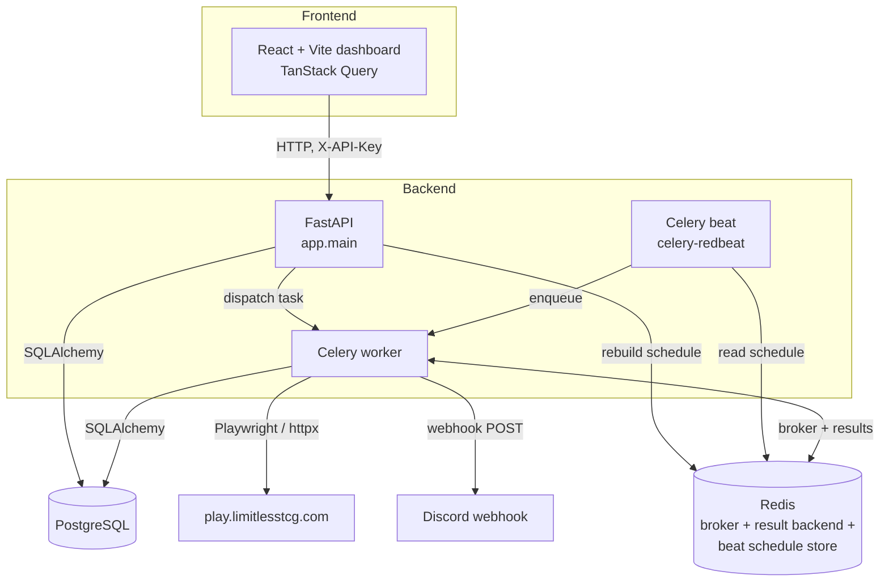
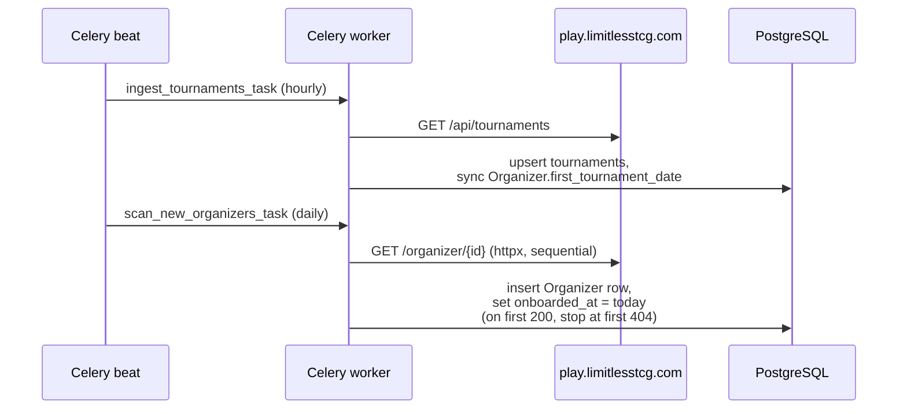
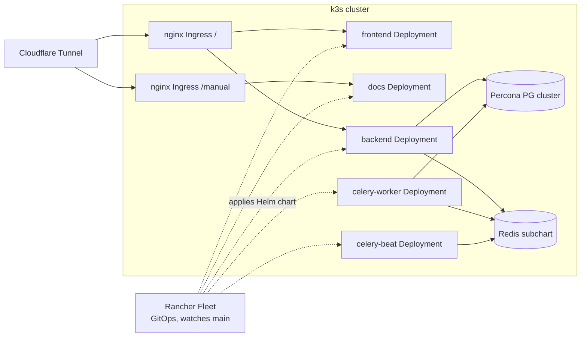

# Architecture

## System overview

The frontend never talks to Celery, Redis, or Postgres directly — every
interaction goes through the FastAPI backend over a single `X-API-Key`
header. Celery beat doesn't run business logic itself; it reads a schedule
from Redis (written by the backend) and enqueues tasks for the worker.

## Backend

- **FastAPI** (`backend/app/main.py`) — the only process that talks to the
  frontend. Routers are split by domain (`status`, `organizers`, `tasks`,
  `admin`) — see [API Reference](api.md).
- **Celery worker** — runs the scraper (Playwright) and the data-ingestion
  tasks (`httpx`). Tasks are dispatched either by Celery beat on a schedule,
  or directly by the API for on-demand triggers (every beat-scheduled task
  also has a manual trigger endpoint — see [Developer Guide](developer-guide.md)).
- **Celery beat** — reads `RedBeatSchedulerEntry` objects from Redis instead
  of a static import-time schedule. The backend rebuilds these entries on
  startup and after every `PUT /api/admin/config` write, so changing an
  interval from the admin UI takes effect without restarting beat. See
  [Configuration](configuration.md).
- **PostgreSQL** — system of record: application status history,
  resubmissions, ingested tournaments, organizer activity/onboarding data,
  the event log, and admin config overrides.
- **Redis** — three jobs: Celery broker, Celery result backend, and the
  beat schedule store (via `celery-redbeat`).

## Frontend

React + TypeScript, built with Vite, using TanStack Query for all server
state (no separate global store). The dashboard has two top-level areas:

- **My Application / Organizers tabs** — status timeline, resubmission log,
  organizer activity chart, onboarding-rate scatter + wait estimator,
  recently-onboarded table, and at-a-glance stat cards.
- **Admin tab** — event log viewer, diagnostics, task-trigger buttons, and
  config editor. All admin endpoints require the `X-API-Key` header, same
  as the rest of the API.

## Data flow: organizer onboarding

Two independent signals feed the `Organizer` table:

1. **Tournament ingestion** discovers an organizer's `first_tournament_date`
   (the date their earliest known tournament occurred) — an indirect signal
   that can lag the organizer's actual onboarding.
2. **The daily onboarding scanner** probes organizer IDs sequentially above
   the current watermark and records `onboarded_at` the day it first
   observes a `200` on that organizer's public profile page — a direct,
   real-time signal, but only available for IDs the scanner has reached
   (≥ 2723, the watermark when the scanner went live).

The onboarding-rate regression (Pareto frontier + OLS fit over the top 1,000
organizer IDs by `first_tournament_date`) ties these together to estimate
how long a new applicant should expect to wait. See the requirements table's
FR12/FR17 entries for the full mechanics, and the forthcoming `docs/metrics/`
section for a deep dive on the math.

## Deployment

Production is deployed via the Helm chart at
`charts/limitless-organizer-tracker/`, applied by Rancher Fleet watching
`main` (`fleet.yaml` at repo root). Staging uses the same chart with
`values.staging.yaml`, deployed manually (not via Fleet — see
[Staging Deployment](deployment/staging.md)) so feature branches can be
validated before merge. A Cloudflare Tunnel (configured outside this repo,
in the cluster's `cloudflared` setup) exposes the production ingress
publicly; it is not part of this Helm chart. See
[Deployment](deployment/local.md) for the full breakdown of each
environment.

The documentation site (this MkDocs site) is built into its own `docs`
image and deployed the same way as the frontend, but reachable at
`/manual` through a separate Ingress resource so docs releases never
require a frontend rebuild — see
[Helm Reference](deployment/helm.md#docs-site-manual).
