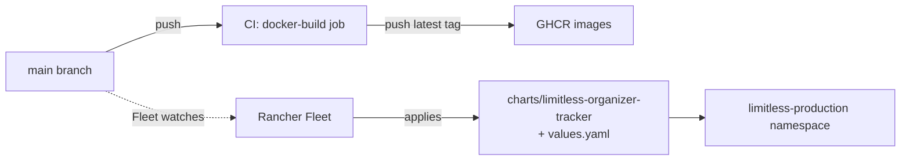

# Production Deployment

Production runs on the same cube cluster (k3s on openSUSE MicroOS, managed
via Rancher) as staging, in the `limitless-production` namespace, but is
deployed via GitOps rather than manual `helm` commands.

## GitOps flow



- **Fleet** (`fleet.yaml` at the repo root) watches `main` and applies the
  Helm chart with `values.yaml` automatically — there is no manual `helm
  upgrade` step for production.
- `fleet.yaml`'s `defaultNamespace` is `limitless-production`.
- Images are tagged `latest` and pushed to GHCR by the `docker-build` CI
  job, which only runs on pushes to `main` (see `.github/workflows/ci.yml`).
  Because Fleet and the image tag both react to `main`, **never merge
  unvalidated changes** — staging verification is the gate (see
  [Staging](staging.md)).

## Components

Same chart, same component set as staging — see
[Architecture](../architecture.md#deployment) for the diagram and
[Helm Reference](helm.md) for the full values breakdown. Production-specific
choices:

- **Ingress**: `ingress.enabled: true`, nginx ingress class, TLS off at the
  ingress level (TLS terminates at the Cloudflare Tunnel instead).
- **Percona PG**: `5Gi` storage, backups enabled (`pgbackrest`).
- **Redis**: `1Gi` persistence.
- **Cloudflare Tunnel**: `cloudflared` runs in its own `cloudflare`
  namespace (configured outside this repo, dashboard-managed hostnames) and
  routes the public hostname to the in-cluster ingress/services. There is
  no tunnel manifest in this repository to maintain.

## Secrets

Production secrets (`DATABASE_URL`, Celery broker/result URLs, Discord
webhook, Limitless credentials, API key) are **not** committed anywhere —
they're supplied to Fleet/Helm out-of-band (e.g. via a Fleet
`targetCustomizations` secret reference or `--set` at install time,
depending on how the cluster is currently bootstrapped). See
[Helm Reference](helm.md#values-reference) for the full `secrets.*` key
list and the rule that these must never be committed.

## Verifying a production rollout

```bash
kubectl --context mcgee-local -n limitless-production get pods
kubectl --context mcgee-local -n limitless-production rollout status deployment/limitless-backend
curl https://limitless-org-dashboard.badconfig.com/healthz   # via Cloudflare Tunnel
```

If `mcgee-local` times out (off-network), use the `mcgee-remote` context
instead.

## Database

Percona PG Operator v3 manages the `limitless-pg` cluster CRD (see
[Helm Reference](helm.md#the-percona-pg-cluster)). There's a single
instance with no HA replica in the current setup — failover/backup
recovery is via `pgbackrest`, not automatic failover.
